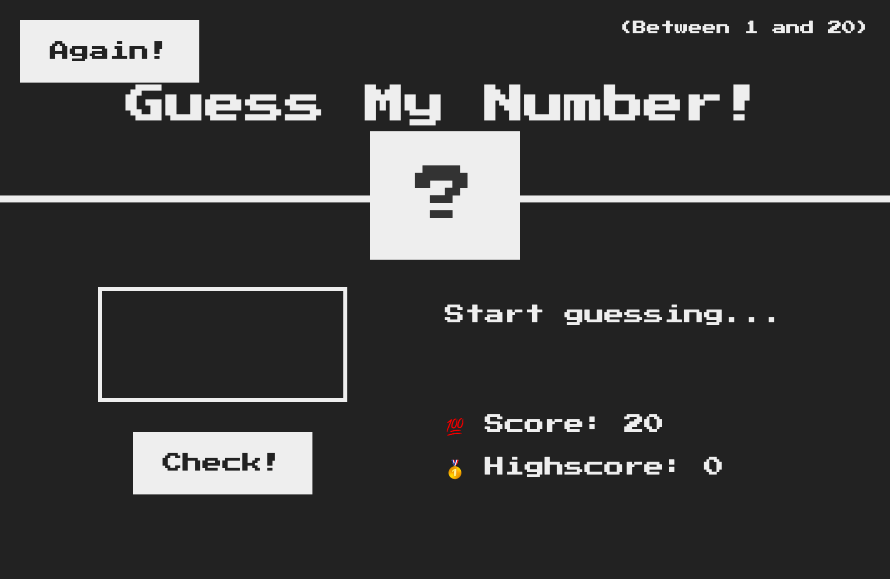
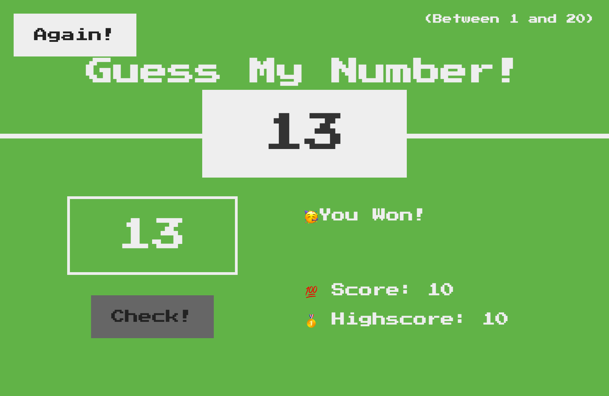

# Guess My Number Game

Welcome to the Guess My Number game! This is a simple and interactive number guessing game where players attempt to guess a randomly generated number within a specified range.

## How to Play

1. Enter a number between 1 and 20 into the input field.
2. Click the "Check!" button to submit your guess.
3. Receive feedback on whether your guess is correct, too high, or too low.
4. Keep guessing until you correctly guess the secret number or run out of attempts.
5. Try to beat your high score and have fun playing!

## Features

- Generates a random secret number between 1 and 20.
- Provides feedback on the accuracy of your guesses.
- Keeps track of your score and high score.
- Interactive and easy-to-use interface.

## Technologies Used

- HTML5, CSS3 for the user interface.
- JavaScript for the game logic and interactivity.

## Getting Started

1. Clone or download the repository to your local machine.
2. Open the `index.html` file in a web browser to start playing.

## Preview

## License

This project is licensed under the MIT License - see the [LICENSE](LICENSE) file for details.
